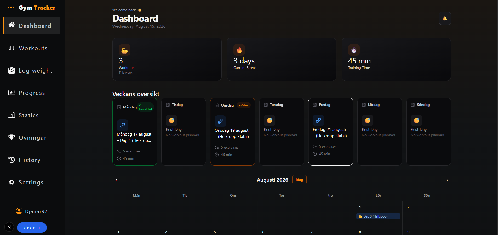
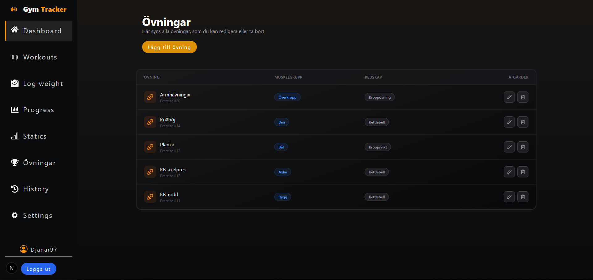
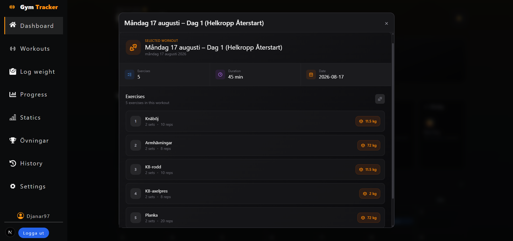

# 🏋️ GymTracker

GymTracker is a full-stack fitness tracking application built with Next.js, TypeScript, Prisma and MySQL.

The application allows users to manage their fitness goals, workouts and workout sessions while tracking their progress over time.

## ✨ Features

- 🔐 User authentication
- 👤 User profile and settings
- 🎯 Fitness goals
- 🏋️ Workout management
- 📅 Workout scheduling
- 📊 Dashboard with weekly overview
- ✅ Workout session tracking
- 📈 Progress tracking
- 🔒 Protected routes with middleware
- 🗄️ MySQL database with Prisma ORM
- 🔌 REST API endpoints
- 🧩 Service and repository architecture
- 📱 Responsive UI

- ## 📸 Screenshots

## 📸 Screenshots

### Dashboard

<p align="center">
  
</p>

<br />

### Workout Management

<p align="center">
  
  
</p>

## 🛠️ Tech Stack

### Frontend

- Next.js
- React
- TypeScript
- CSS Modules
- React Icons

### Backend

- Next.js API Routes
- TypeScript
- Prisma ORM
- MySQL
- JWT authentication

### Development

- Node.js
- npm
- Git
- GitHub

## 🏗️ Architecture

The project follows a layered architecture separating API routes, services, repositories and data models.

```text
app/
├── api/
│   ├── auth/
│   ├── workouts/
│   ├── workout-sessions/
│   └── ...
│
├── dashboard/
├── login/
└── register/

services-server/
├── auth-service.ts
├── workout-service.ts
├── workout-session-service.ts
└── ...

repositories/
├── auth-repository.ts
├── workout-repository.ts
├── workout-session-repository.ts
└── ...

types/
├── api-types.ts
├── user-types.ts
├── workout-types.ts
└── ...

schemas/
├── auth-schemas.ts
└── ...
```
